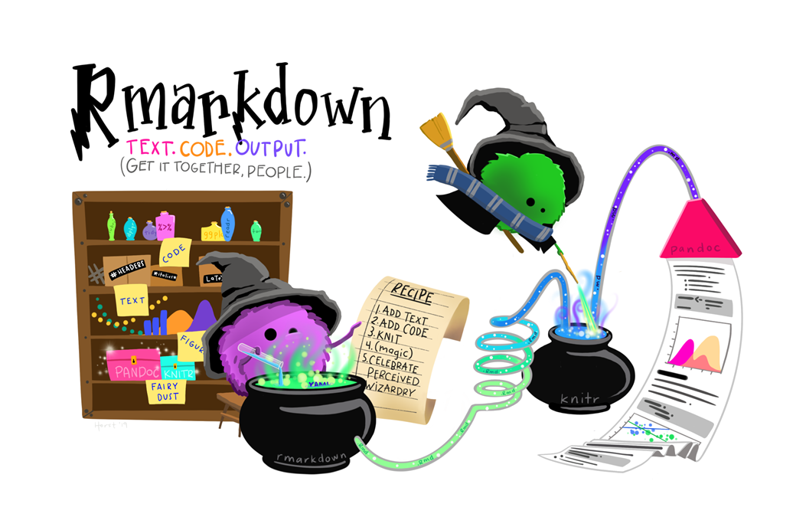
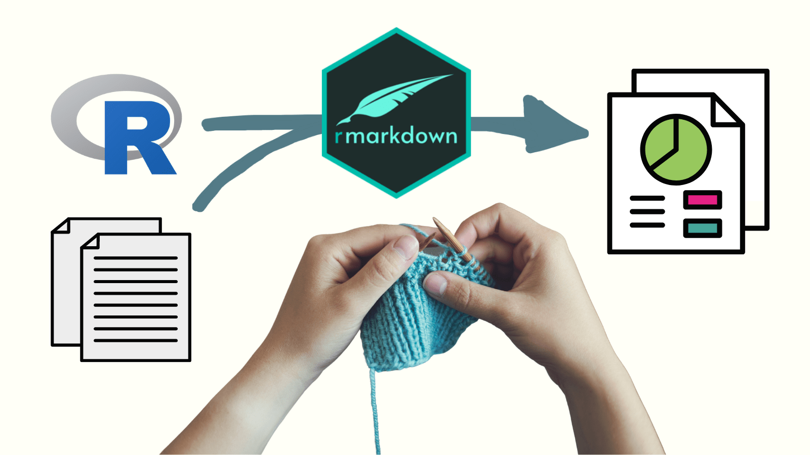

<style>
body, p {
  background-color: light;
  color: black; 
  font-family: Arial;
  font-size: 12;
}
</style>

### **R Markdown**

This is an R Markdown document. Markdown is a simple formatting syntax for authoring HTML, PDF, and MS Word documents. For more details on using R Markdown see <http://rmarkdown.rstudio.com>.

When you click the **Knit** button a document will be generated that includes both content as well as the output of any embedded R code chunks within the document. You can embed an R code chunk like this:

```{r cars}
summary(cars)
```

### Including Plots

You can also embed plots, for example:

```{r , echo=FALSE}
plot(pressure)
```

Note that the `echo = FALSE` parameter was added to the code chunk to prevent printing of the R code that generated the plot.

> # **Base para gerar nosso documento**:

> *Relembrando que:*

1. **YAML** 
-   Uma seção de metadados
-   Informações que serão usadas para gerar o arquivo final;
-   Título do relatório;
-   Autoria, data;
-   Formato gerado, etc;
-   Logo após, podemos definir aspectos da fonte via </style>;
-   Há temas predefinidos que podem ser utilizados (ver exemplo 2 deste Rmd).

2. **Chuncks**
-   Nos campos de código (também chamados de chunks) podemos adicionar códigos em R (ou em algumas outras linguagens);
-   Os chunks são delimitados por três crases, e a linguagem deve ser especificada entre chaves.

3. **Markdown**
+   É um formato de simples de markup, ou seja, de marcação de texto;
+   Há diversos comando em que podemos marcar os nossos textos e códigos usando markdown.

4. **CheatSheets (links)**
*   [1. Geral](https://rstudio.github.io/cheatsheets/html/rmarkdown.html)
*   [2. Geral2](https://www.rstudio.com/wp-content/uploads/2015/03/rmarkdown-reference.pdf)
*   [3. Chunks](https://yihui.org/knitr/options/#chunk-options)
*   [4. markdown](https://cheatography.com/lucbpz/cheat-sheets/the-ultimate-markdown/)

### **Opções básicas:**

1.    **markdown**
*   Destacar o texto em **negrito** (texto entre pares **)
*   Destacar o texto em *itálico* (texto entre *)
*   Tachar o ~~texto~~ (texto entre pares de ~~) 
+   Podemos usar o # para criar seções hierárquicas.
+   Usamos 1. 2. 3. seguidos de 'tab' para criar listas numeradas.
+   Usamos + , - ou * para criar listas não numeradas.
+   Usamos [](link) para inserir links no documento.
+   Usamos > para inserir uma citação em bloco.
+   Podemos criar verbatim com o uso de texto entre ```

2.    **Chunks**
+   eval - Indica se o código deve ser executado.
+   include - Indica se o código deve ser exibido no documento final. Os resultados não serão apresentados.
+   collapse - Indica se o código e os resultados do chunk devem ser colapsados em um bloco único.
+   echo - Indica se o código será exibido no documento final. Os resultados serão apresentados.
+   error -  	Indica se mensagens de erros serão exibidas.
+   message - Indica se mensagens geradas pelo código serão exibidas.
+   warning - Indica se avisos gerados pelo código serão exibidos.
+   fig.cap - Título de gráfico referente ao chunk.
+   fig.height - Altura para gráficos criados pelo código (em polegadas).
+   fig.width - Largura para gráficos criados pelo código (em polegadas).
+   out.height - Proporção do tamanho da figura original inserida pelo código (espessura).


```
Ainda, Podemos Inserir figuras em nosso documento:
-> Direto de algum site / repositório;
  -
-> Figura da pasta em que estamos trabalhando;
  -knitr::inlude_grphics(link)
  
```
#### Figura de link externo:


#### Figura de uma pasta de trabalho:

```{r, fig.align='center',fig.cap="Figura Rmarkdown",out.height="50%"}

```


> ## Chunk: Código em R

- **Podemos incluir os chuncks com o comando "Ctrl + Alt + I"**

```{r, include=FALSE}
#CARREGANDO O(S) PACOTE(S)
library(tidyverse)
library(palmerpenguins)

#Carregando os dados:
data("penguins")

#Lendo os dados
head(penguins)
 
# calcula a média da massa corporal
media_massa_g <-
  mean(penguins$body_mass_g, na.rm = TRUE) 

 # converte de gramas para kilogramas
media_massa_kg_completo <-
  media_massa_g / 1000 

 # arredonda o valor para ter uma casa decimal
media_massa_kg <- round(media_massa_kg_completo, 1)

 # exibe o resultado
media_massa_kg 
```
###   Ajustes gerais do chunk
-   Veja que o include = FALSE desativa todo o chunck
-   Normalmente utilizamos warning = FALSE e message = FALSE
-   Silenciar o echos nem sempre é o ideal para o uso de relatórios científicos.

**Podemos setar esses parametros do chunk de maneira geral**

```{r setup}
knitr::opts_chunk$set(echo = TRUE, warning = FALSE, message = FALSE)
```

####    Usando o exemplo acima:
```{r}
#CARREGANDO O(S) PACOTE(S)
library(tidyverse)
library(palmerpenguins)

#Carregando os dados:
data("penguins")

#Lendo os dados:
head(penguins)
 
# calcula a média
media_massa_g <-
  mean(penguins$body_mass_g, na.rm = TRUE) 

 # converte de gramas para kilogramas
media_massa_kg_completo <-
  media_massa_g / 1000 

 # arredonda o valor para ter uma casa decimal
media_massa_kg <- round(media_massa_kg_completo, 1)

 # exibe o resultado
media_massa_kg 
```
-   Veja que nossos resultados foram apresentados em um verbatim separado

###   Gerar uma tabela para resumir meus dados:
```{r}
media_massa <- penguins %>% # usamos a base de pinguins
  # agrupamos por especies, ilhas, sexo e ano
  dplyr::group_by(species, island ,sex, year) %>%  
  # calculamos a média da massa corporal 
  dplyr::summarise(media_massa = mean(body_mass_g, na.rm = TRUE)) %>% 
  # criamos uma nova coluna, com a massa em kg, e arredondada com 2 casas decimais
  dplyr::mutate(media_massa_kg = round(media_massa / 1000, 2)) %>%  
  # removemos a coluna da massa em gramas
  dplyr::select(-media_massa)

# Apresentamos o resultado da tabela:
media_massa

#Utilizando o pacote knitr: função kable()
media_massa %>%
  knitr::kable(align = "c",
               caption = "<center><strong> Tabela 1. Massa média de Palmer ")

#Tabela interativa:
media_massa %>%
  DT::datatable()
```

> ####    Tabelas podem ser escritas diretamente no markdown

|Right|Left|Default|Center|
|----:|:---|-------|:----:|
|12   |12  |12     |12    |
|123  |123 |123    |123   |
|1    |1   |1      |1     |

Veja que a segunda linha definiu a posição dos elementos na tabela.

####  --- Vamos ver um exemplo de relatório com a nossa rotina da aual de ggplot ---

> # **Bico de penguins: relação entre comprimento e espessura depende da espécie**

###   Descrição dos dados:
+   Este conjunto de dados contêm informações sobre 344 pinguins, de 3 espécies diferentes, coletadas de 3 ilhas no Arquipélago Palmer, na Antártica.

+   O conjunto de dados abarca medições do tamanho e espessura dos bicos em mm, massa corporal em grama e tamanho das nadadeira em mm.


```{r pacotes, echo=FALSE}

#CARREGANDO O(S) PACOTE(S)
library(tidyverse)
library(palmerpenguins)
library(viridis)
library(ggpubr)
```

```{r dados}
#Carregando os dados:
data("penguins")

#Resumo dos dados:
str(penguins)

#Removendo 'NAs'
penguins_clean<-na.omit(penguins)

```

###   Verificando a relação entre comprimento e espessura dos bicos:
```{r,echo=FALSE, fig.align='center',fig.cap="Penguins",out.height="50%", out.width="50%"}
knitr::include_graphics("penguins.png")
```

####    1.Para todo o gênero
``` {r análises gerais, echo = FALSE}
#Relação para o conjunto de dados completo:
lm_geral <- lm(penguins_clean$bill_length_mm~penguins_clean$bill_depth_mm)

summary(lm_geral)
```

```{r plot geral,echo=FALSE, fig.align="center", fig.height=10, fig.width=10, echo=FALSE, fig.cap="Fig.1 Relação entre comprimento e espessura dos bicos "}

penguins %>% ggplot(aes(x=bill_depth_mm, y= bill_length_mm))+
  geom_point(size=2)+
  geom_smooth(method='lm') +
    theme_classic()

```
+   Encontramos um relação negativa entre as variáveis. Ou seja, nesse caso quanto mais comprido o bico, menor a sua espessura.

####    2.Para cada espécie:
``` {r análises por espécies ade, echo=FALSE}
# - Correlação para Adelie
lm_sp<-lm(bill_depth_mm~bill_length_mm*species,na.omit(penguins))

summary(lm_sp)

```

```{r análises por espécie, echo=FALSE,fig.align="center", fig.height=5, fig.width=7, echo=FALSE, fig.cap=" Fig.2 Relação entre comprimento e espessura dos bicos por espécies"}

penguins %>% 
  ggplot(aes(bill_depth_mm, bill_length_mm, col = species)) + 
  geom_point(alpha = 0.5)+
  stat_regline_equation(label.y.npc = 0.99, size = 4) +
  geom_smooth(method = "lm", se = F)+
  stat_cor(aes(label = paste(..p.label..)),
           label.y.npc = .99, label.x.npc = 0.6, p.digits = 2, size = 4) +
  geom_smooth(method = "lm", col = "black", se = F)+
  theme_classic()+
  scale_color_viridis(discrete = TRUE)

```
+   Nossos resultados indicam que a relação entre espessura e comprimento dos bicos depende da espécie e é inversa aquela encontrada para o gênero como um todo.


```{r,echo=FALSE,fig.align='center',fig.cap="Bora costurar",out.height="50%", out.width="50%"}

```
